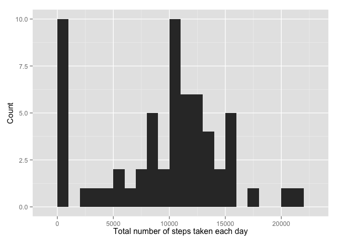
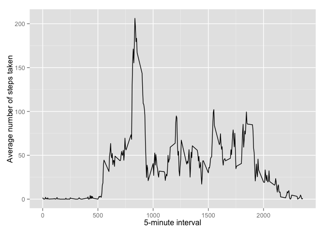
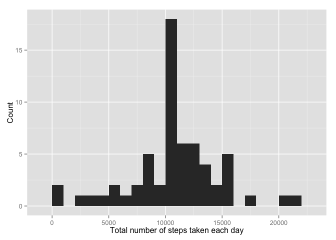
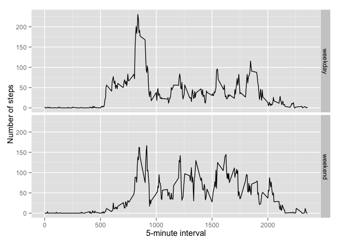

# Reproducible Research: Peer Assessment 1


## Loading and preprocessing the data

```r
data <- read.csv("activity.csv")
```


## What is mean total number of steps taken per day?

```r
library(ggplot2)
```

```
## Warning: package 'ggplot2' was built under R version 3.1.3
```

```r
total_steps <- tapply(data$steps, data$date, FUN=sum, na.rm=TRUE)
qplot(total_steps, binwidth=1000, xlab="Total number of steps taken each day", ylab = "Count")
```

 

```r
mean(total_steps, na.rm=TRUE)
```

```
## [1] 9354.23
```

```r
median(total_steps, na.rm=TRUE)
```

```
## [1] 10395
```


## What is the average daily activity pattern?

```r
library(ggplot2)
Ave <- aggregate(x=list(steps=data$steps), by=list(interval=data$interval),
                      FUN=mean, na.rm=TRUE)
ggplot(data=Ave, aes(x=interval, y=steps)) +
    geom_line() +
    xlab("5-minute interval") +
    ylab("Average number of steps taken")
```

 

Which 5-minute interval, on average across all the days in the dataset, contains the maximum number of steps?

```r
Ave[which.max(Ave$steps),]
```

```
##     interval    steps
## 104      835 206.1698
```

## Imputing missing values

Note that there are many days/intervals where there are missing values (coded as `NA`). The presence of missing days may introduce bias into some calculations or summaries of the data.


```r
Missing <- is.na(data$steps)
table(Missing)
```

```
## Missing
## FALSE  TRUE 
## 15264  2304
```

Fill in missing values with mean value for that 5-minute interval.


```r
fill.value <- function(steps, interval) {
    filled <- NA
    if (!is.na(steps))
        filled <- c(steps)
    else
        filled <- (Ave[Ave$interval==interval, "steps"])
    return(filled)
}
filled.data <- data
filled.data$steps <- mapply(fill.value, filled.data$steps, filled.data$interval)
```
Using the filled data set, make a histogram of the total number of steps taken each day and calculate the mean and median total number of steps.


```r
total_steps <- tapply(filled.data$steps, filled.data$date, FUN=sum)
qplot(total_steps, binwidth=1000, xlab="Total number of steps taken each day", ylab="Count")
```

 

```r
mean(total_steps)
```

```
## [1] 10766.19
```

```r
median(total_steps)
```

```
## [1] 10766.19
```

Mean and median values are higher after imputing missing data because NA were set to 0s by default. After replacing NA with mean value, there will be increase in mean and median values.

## Are there differences in activity patterns between weekdays and weekends?
Create a new factor variable in the dataset with two levels – “weekday” and “weekend” indicating whether a given date is a weekday or weekend day.


```r
weekday.or.weekend <- function(date) {
    day <- weekdays(date)
    if (day %in% c("Monday", "Tuesday", "Wednesday", "Thursday", "Friday"))
        return("weekday")
    else if (day %in% c("Saturday", "Sunday"))
        return("weekend")
    else
        stop("invalid date")
}
filled.data$date <- as.Date(filled.data$date)
filled.data$day <- sapply(filled.data$date, FUN=weekday.or.weekend)
```

Make a panel plot containing plots of average number of steps taken on weekdays and weekends.

```r
Ave <- aggregate(steps ~ interval + day, data=filled.data, mean)
ggplot(Ave, aes(interval, steps)) + geom_line() + facet_grid(day ~ .) +
    xlab("5-minute interval") + ylab("Number of steps")
```

 
